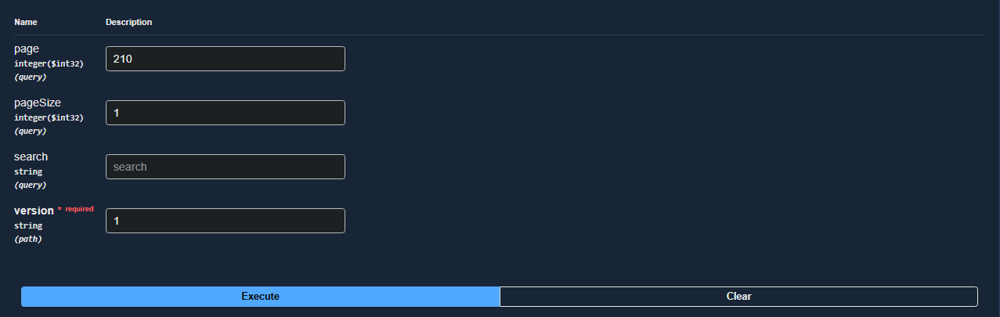
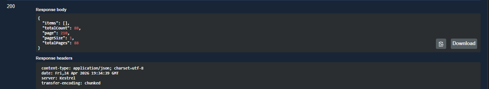

# Bug: Paginação negativa via API

## Descrição
Ao inserir via API uma quantidade de páginas inexistentes é retornado uma consulta de todos os dados com Status 200 

## Passos para reproduzir
1. Simplesmente realizar requisição GET com um valor considerável em 'page' 
2. GET /api/v1.0/categorias?page=200&pageSize=1

## Resultado atual
- Retorna 200
- Retorna lista vazia
- Mantém "page = 200" mesmo com "totalPages = 1"

## Resultado esperado
- API deveria retornar erro (400 ou 404)  ou ajustar automaticamente para a última página

## Evidências

## Ambiente
- API: http://localhost:5000
- Front: http://localhost:5173
- Navegador: Chrome
- Versão: v1
