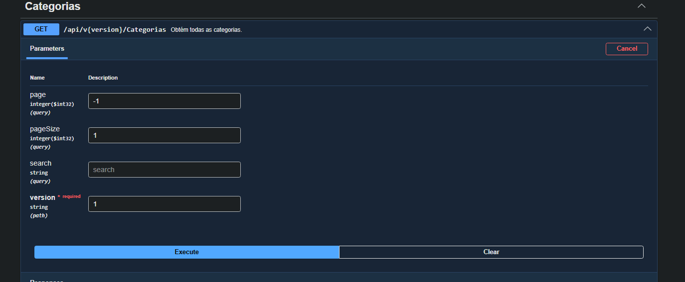
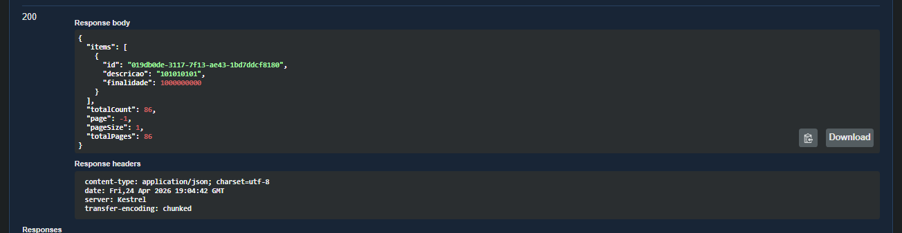
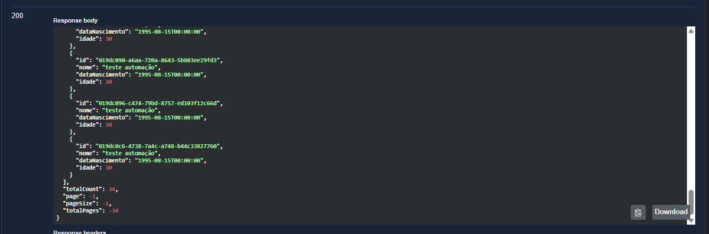

# Bug: Paginação sem validação via API

## Descrição
Ao inserir uma quantidade negativa no campo ‘page’ desejada e no campo ‘pageSize’, então dados são listados normalmente, contendo em seu response “page”, “pageSize”, “totalPages” ambos com valor negativo

## Passos para reproduzir
1. Simplesmente realizar requisição GET com dados negativos em 'page' e 'pageSize'
2. GET /api/v1.0/categorias?page=-1&pageSize=-5

## Resultado atual
-  Dados exibidos normalmente
- `page`,`pageSize`, `totalPages` **negativos**

## Resultado esperado
- Retornar erro de validação (400 Bad Request)
- Impedir valores negativos

## Evidências

## Ambiente
- API: http://localhost:5000
- Front: http://localhost:5173
- Navegador: Chrome
- Versão: v1
