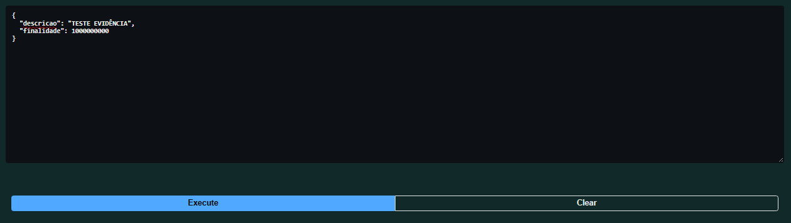
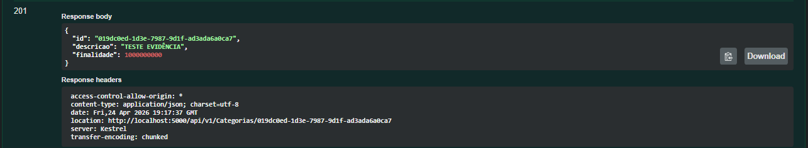

# Bug: Categoria aceita finalidade iválida

## Descrição
Ainda seguindo o problema da validação de finalidade é possivel realizar a criação de uma categoria com sua finalidade portando valores consideravelmente grandes

## Passos para reproduzir
1. Realizar uma requisição POST para criação de uma categoria
2. POST /api/v1.0/categorias  
{  
  "descricao": "TESTE EVIDÊNCIA",  
  "finalidade": 1000000000  
}

## Resultado atual
-  Categoria criada com sucesso
- Front exibe categoria criada com finalidade `Ambas`

## Resultado esperado
- Validar enum `(0,1,2)`
- Retornar erro para valores inválidos
## Evidências

## Ambiente
- API: http://localhost:5000
- Front: http://localhost:5173
- Navegador: Chrome
- Versão: v1
