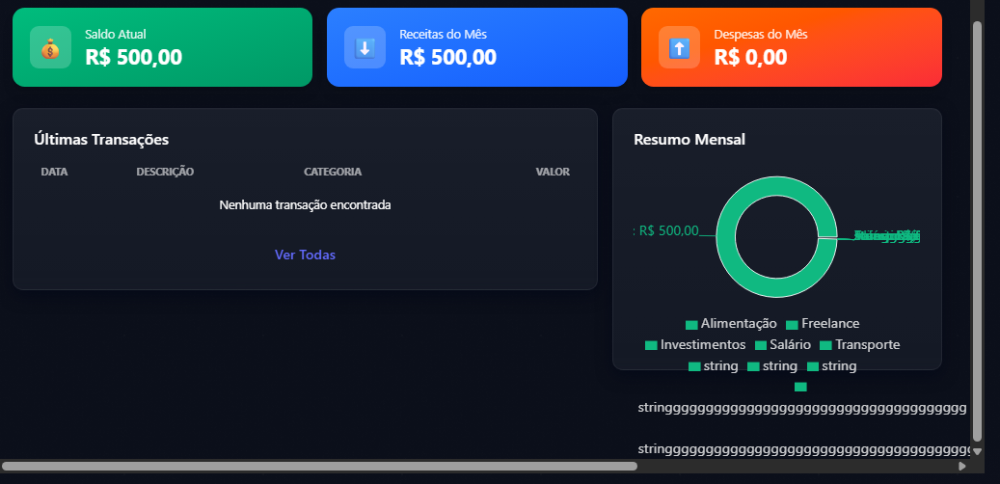
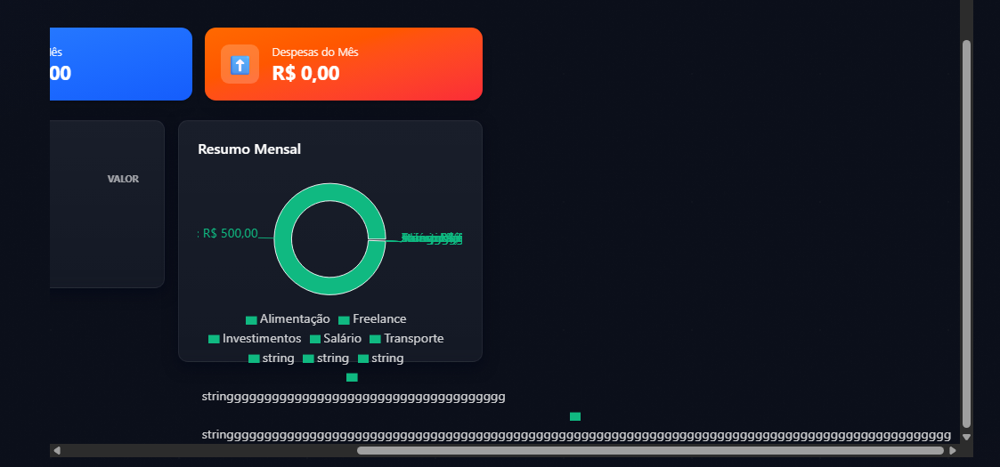

# Bug: Problemas visuais ou responsivos (Front)

## Descrição
A depender do tamanho da descrição de uma categoria, há uma quebra no layout e responsividade do gráfico do Dashboard, deixando os componentes fora do padrão

## Passos para reproduzir
1. Acessar p dashboard da aplicação `http://localhost:5173/`
2. Realizar o cadastros de `Categorias` com sua `descricao` consideravelmente grande
3. Scrollar ate `Resumo Mensal` 

## Resultado atual
- Há uma quebra de layout no gráfico, bugando alguns componentes visuais
- criação de um Scroll lateral muito grande

## Resultado esperado
- Exibição dos componentes do front dentro do padrão indepente do tamanho da `descricao` de `Categorias`
## Evidências

## Ambiente
- API: http://localhost:5000
- Front: http://localhost:5173
- Navegador: Chrome
- Versão: v1
