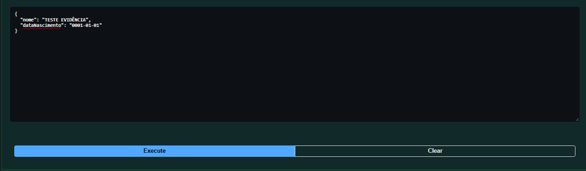
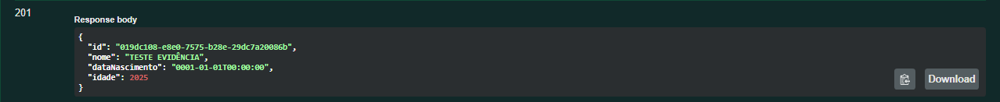

# Bug: Criação de pessoa com idade exagerada

## Descrição
Sistema permite criação de pessoas com idade extremamente alta.

## Passos para reproduzir
1. Realizar uma requisição POST para criação de uma pessoa
2. POST /api/v1.0/pessoas  
{  
  "nome": "TESTE EVIDÊNCIA",  
  "dataNascimento": "0001-01-01"  
}  

## Resultado atual
-  Idade absurda calculada
- Reflete no frontend

## Resultado esperado
- Validação de idade com limite razoável
## Evidências

## Ambiente
- API: http://localhost:5000
- Front: http://localhost:5173
- Navegador: Chrome
- Versão: v1
