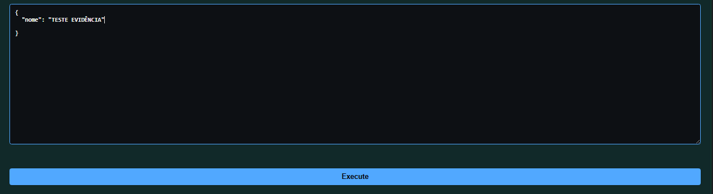
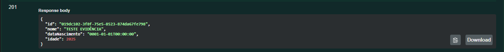

# Bug: Criação de uma pessoa sem idade via API

## Descrição
API permite criar pessoa sem `dataNascimento`, preenchendo automaticamente com `01/01/0001`.

## Passos para reproduzir
1. Realizar uma requisição POST para criação de uma pessoa
2. POST /api/v1.0/pessoas  
{  
  "nome": "TESTE EVIDÊNCIA"  
}

## Resultado atual
-  Pessoa criada
- DataNascimento = `0001-01-01`

## Resultado esperado
- Campo `DataNascimento` deve ser obrigatório
- Retornar erro 400

## Evidências

 

## Ambiente
- API: http://localhost:5000
- Front: http://localhost:5173
- Navegador: Chrome
- Versão: v1
