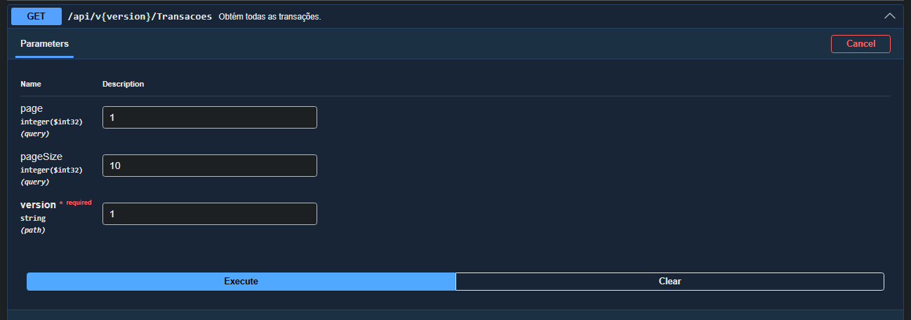
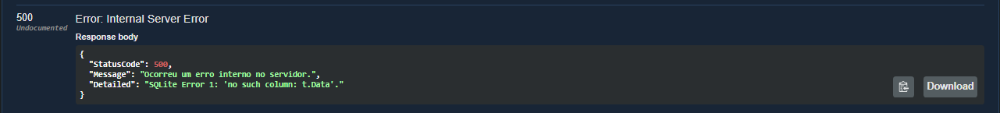
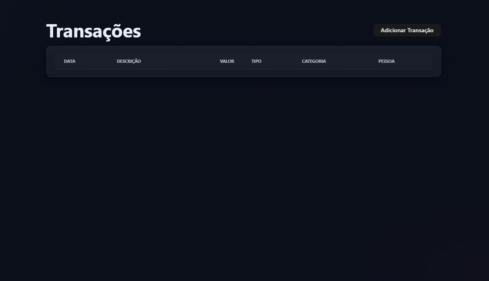
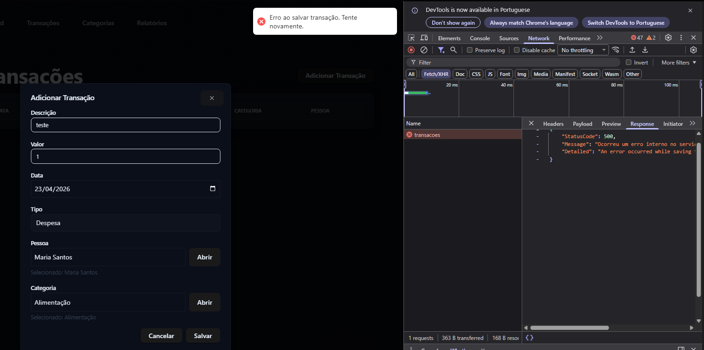

# Bug: Módulo de transações com problema estrutural

## Descrição
Todas as rotas testadas retornam erro 500.

## Passos para reproduzir
1. Realizar uma requisição GET apenas para litagem 
2. GET /api/v1.0/transacoes

## Resultado atual
-  Status 500 (Internal Server Error)

## Resultado esperado
- Status 200 ou erro tratado
## Evidências

## Ambiente
- API: http://localhost:5000
- Front: http://localhost:5173
- Navegador: Chrome
- Versão: v1
